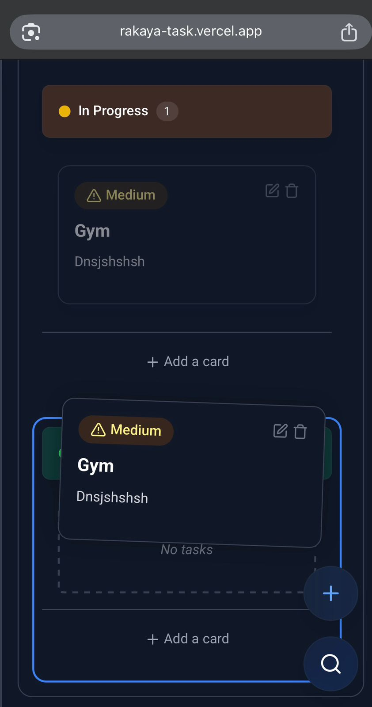
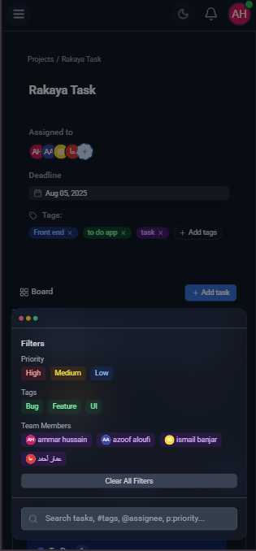

<div align="center">
  
</div>

# Rakaya Task Management Board

<div align="center">
  
  
</div>
<div align="center">
  
  
</div>

## Overview

A modern, responsive task management board application built with React, TypeScript, and Tailwind CSS. This project was created as a technical challenge for Rakaya Frontend, got some inspiration from Trello and Jira.

## Live Demo

[View Live Demo](https://rakaya-task.vercel.app/)

## Features

### Core Requirements

- **Four-column Kanban Board**: Backlog, To Do, In Progress, and Need Review
- **Drag-and-Drop Functionality**: Easily move tasks between columns using dnd-kit
- **Full CRUD Operations**: Create, read, update, and delete tasks
- **Task Properties**: Each task includes title, description, priority, and assignee
- **Search Functionality**: Filter tasks by title, content
- **Advanced Filtering**: Filter by priority, status, and assignee
- **Responsive Design**: desktop, tablet, and mobile devices
- **State Management**: Using Zustand for efficient state management

### Additional Implementations

- **Dark Mode Support**: Toggle between light and dark themes
- **Advanced Notification System**: Toast notifications with persistent history in notification bell
- **System Status Visibility**: Loading indicators, toast notifications
- **Member Management**: Add and manage team members
- **Glass Effect UI**: Modern, translucent interface elements with backdrop blur, inspired by iOS 26 liquid glass style
- **Animations**: Subtle animations for improved user experience
- **Persistent State**: Task and filter states are saved in local storage
- **Keyboard Shortcuts**: Space key to add new tasks, Escape to close modals

<div align="center">
  <h3>UI Components & Interactions</h3>
</div>

<table>
  <tr>
    <td width="50%">
      
      <p align="center"><em>Task Dialog - Light Theme</em></p>
    </td>
    <td width="50%">
      
      <p align="center"><em>Toast Notification</em></p>
    </td>
  </tr>
  <tr>
    <td width="50%">
      
      <p align="center"><em>Notification Center</em></p>
    </td>
    <td width="50%">
      
      <p align="center"><em>Delete Confirmation Dialog</em></p>
    </td>
  </tr>
</table>

<div align="center">
  <h3>Search & Filtering</h3>
</div>

<table>
  <tr>
    <td width="100%">
      
      <p align="center"><em>Advanced Search and Filtering Interface</em></p>
    </td>
  </tr>
</table>

## Tech Stack

- **Frontend Framework**: React with TypeScript
- **State Management**: Zustand
- **Icons**: Lucide React
- **Styling**: Tailwind CSS with PostCSS and Autoprefixer
- **Drag-and-Drop**: dnd-kit
- **Fonts**: Roboto from Google Fonts

## Setup Instructions

### Installation

1. Clone the repository:

   ```bash
   git clone https://github.com/3mmar19/rakaya-task.git
   cd rakaya-task
   ```

2. Install dependencies:

   ```bash
   npm install
   # or
   yarn install
   ```

3. Start the development server:

   ```bash
   npm start
   # or
   yarn start
   ```

4. Open your browser and navigate to `http://localhost:3000`

## Project Structure

```
src/
├── components/         # UI components
│   ├── Board/          # Board-related components (Board, BoardHeader)
│   ├── Columns/        # Column components (Column)
│   ├── Layout/         # Layout components (Header, Sidebar, Layout)
│   ├── Tasks/          # Task-related components (TaskCard, TaskAssignments, TaskForm)
│   └── UI/             # Reusable UI components (SearchBar, FloatingSearchButton, Modal, etc.)
├── context/            # React context providers
│   └── ToastContext.tsx # Toast notification context and provider
├── store/              # Zustand stores with persist middleware
│   ├── filterStore.ts  # Filter and search state management
│   ├── memberStore.ts  # Team member management
│   ├── tagStore.ts     # Tag management for tasks
│   ├── taskStore.ts    # Task CRUD operations and state
│   └── themeStore.ts   # Theme (dark/light) preferences
├── types/              # TypeScript type definitions
├── utils/              # Utility functions
├── App.tsx             # Main application component
└── index.tsx           # Application entry point
```

## Notes

### UI/UX Considerations

- **UX First Approach**: Followed the principle of "Visibility of System Status" to keep users informed about what's happening through appropriate feedback
- **Accessibility Considerations**: Ensured proper contrast ratios and keyboard navigation support
- **Mobile-First Design**: Designed components to work well on mobile devices first, then enhanced for larger screens
- **Glass Effect**: Applied throughout the UI for a modern look
- **System Status Visibility**: Toast notifications, loading spinners, and status indicators provide clear feedback
- **Responsive Design**: Adapts to different screen sizes with a mobile-first approach
- **Haptic Feedback**: added haptic feedback (vibration) on mobile devices in drag-and-drop.


<div align="center">
  <h3>Mobile & Dialog Enhancements</h3>
</div>

<table>
  <tr>
    <td width="33%">
      
      <p align="center"><em>for better ux we added as buttons not list</em></p>
    </td>
        <td width="33%">
      
      <p align="center"><em>for better ux we added habtic or vibrate feedback on mobile</em></p>
    </td>
    <td width="33%">
      
      <p align="center"><em>Mobile Floating Action Button for better ux and quick add btn</em></p>
    </td>
    <td width="33%">
      
      <p align="center"><em>Mobile Search Input in bottom its more faster to reach than top in mobile</em></p>
    </td>
  </tr>
</table>

## Author & Contact

<div align="center">
  
  <h3>Ammar Bin Hussain</h3>
  <p>
    <a href="https://github.com/3mmar19"></a>
    <a href="https://linkedin.com/in/3mmar"></a>
    <a href="mailto:ammarhus.ahmed@gmail.com"></a>
  </p>
</div>
